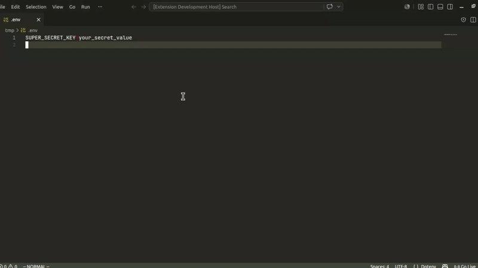

# Envoy

**Share `.env` files securely, no browser, no copy-paste.**

Envoy encrypts your credentials end-to-end and turns them into a one-time link,
all without leaving VS Code.

## How it works

**Sender** (you):
1. Right-click any `.env` file in the Explorer
2. Pick expiration time and an optional password
3. An encrypted link is copied to your clipboard, ready to share

**Receiver** (your teammate):
1. Open the Command Palette, run **Envoy: Open Note**
2. Paste the link, enter the password if prompted
3. The decrypted content opens as an untitled file, never auto-saved

> No Envoy? No problem, the link also works in any browser at [enclosed.cc](https://enclosed.cc).

## Security

- The encryption key lives only in the link fragment, it is never sent to the server
- **Share the link through a private channel** (DM, encrypted chat), never in a public thread
- Notes are ephemeral: by default they self-destruct after the first read
- No account required, no data retained beyond the note's TTL

Envoy uses AES-256-GCM encryption with PBKDF2 key derivation, the same parameters
as the Enclosed web app.

## Configuration

| Setting | Default | Description |
|---------|---------|-------------|
| `envoy.enclosedInstanceUrl` | `https://enclosed.cc` | Enclosed instance to use |
| `envoy.defaultTtl` | `86400` (1 day) | Default link expiration, in seconds |
| `envoy.defaultDeleteAfterReading` | `true` | Destroy note after first read |
| `envoy.shouldCopyEnclosedUrl` | `true` | Copy web link to clipboard; disable to copy VS Code deep link instead |

Access via **Settings → Extensions → Envoy** or add to your `settings.json`.

## Self-hosting

To point Envoy to your own Enclosed instance:

1. Open **Settings → Extensions → Envoy → Instance URL** (`envoy.enclosedInstanceUrl`)
2. Set it to your instance, e.g. `https://notes.mycompany.com`

For self-hosting Enclosed itself, see the [Enclosed documentation](https://github.com/CorentinTh/enclosed).

## About

Envoy uses [Enclosed](https://enclosed.cc) as its backend by default.
Enclosed is an independent open-source project by [@CorentinTh](https://github.com/CorentinTh),
not affiliated with this extension.

Icon credits: see [ATTRIBUTION.md](ATTRIBUTION.md).
